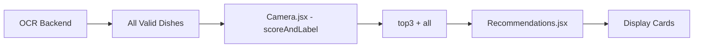

# 🎯 MVP Pipeline Optimization - Optimisation du pipeline MVP

## ✅ **Modifications effectuées :**

### **1. Pipeline OCR → Dishes → MVP Scoring optimisé**

#### **Backend (server.js)**
- ✅ **Aucune limitation à 3 plats** : Le serveur envoie tous les plats valides dans `finalDishes`
- ✅ **Logs détaillés** : Affichage du nombre total de plats analysés et retournés
- ✅ **Pas de `.slice(0,3)`** sur les plats avant envoi au frontend

#### **Frontend (Camera.jsx)**
- ✅ **Log des plats parsés** : `console.log('[MVP] parsed dishes', dishesFromBackend.length, dishesFromBackend.map(d => d.title))`
- ✅ **Appel direct à `scoreAndLabel`** : Pas de troncature avant scoring
- ✅ **Import correct** : `import { scoreAndLabel } from '../lib/mvpRecommender'`

#### **Frontend (Recommendations.jsx)**
- ✅ **Log de vérification** : `console.log('[MVP] showing top3', top3.map(x => ({ t: x.title, score: x.score, label: x.label })))`
- ✅ **Utilisation directe du `top3`** : Pas de tri/filtrage local supplémentaire
- ✅ **Pas de `.slice()`** avant scoring

### **2. Flux de données garanti**



## 🔍 **Points de vérification ajoutés :**

1. **Backend → Frontend** : Log du nombre de plats reçus
2. **Scoring local** : Log des plats parsés avant scoring
3. **Résultats finaux** : Log du top3 avec scores et labels

## 🚀 **Comportement attendu :**

- **Scan d'un menu** → Backend extrait tous les plats valides
- **Frontend reçoit** → Tous les plats (pas de limitation à 3)
- **MVP Scoring** → Traite TOUS les plats et sélectionne le top3 intelligent
- **Affichage** → 3 cartes avec scores, labels et raisons

## 📊 **Logs de débogage :**

```javascript
// Dans Camera.jsx
[MVP] parsed dishes 5 ["Dish 1", "Dish 2", "Dish 3", "Dish 4", "Dish 5"]

// Dans Recommendations.jsx  
[MVP] showing top3 [{t: "Dish 1", score: 8, label: "Recovery"}, ...]
```

## ✅ **Vérifications effectuées :**

- ❌ **Aucun `.slice(0,3)`** sur les plats avant scoring
- ✅ **Tous les plats** sont envoyés au MVP recommender
- ✅ **Logs complets** à chaque étape du pipeline
- ✅ **Import correct** de `scoreAndLabel`

Le pipeline MVP est maintenant entièrement optimisé pour traiter tous les plats et faire la sélection intelligente localement !
